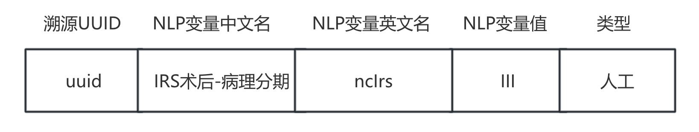

# 疾病名称

**一、定义**

疾病名称通常是指用来识别和分类特定健康问题的术语，世界卫生组织（WHO）等机构会发布疾病分类系统，如国际疾病分类（ICD），以标准化疾病名称和编码。

**二、人工标注原则**

&#x20;   以ICCC-3疾病名称为准，例如：“横纹肌肉瘤”。

**三、示例**

<figure><figcaption>
平台大报卡-疾病名称标注示例
</figcaption></figure>

