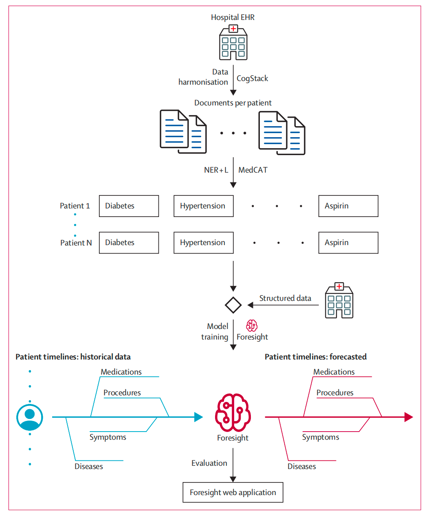

# Foresight——一种使用电子健康记录对患者时间线进行建模的生成式transformer模型：一项回顾性建模研究

**Lancet Digit Health; 2024Apr;Q1 IF: 36.615**

**Foresight—a generative pretrained transformer for modelling of patient timelines using electronic health records: a retrospective modelling study（Foresight——一种使用电子健康记录对患者时间线进行建模的生成式transformer模型：一项回顾性建模研究）**

**一、研究总结**

**1、背景**

An electronic health record (EHR) holds detailed longitudinal information about a patient’s health status and general clinical history, a large portion of which is stored as unstructured, free text. Existing approaches to model a patient’s trajectory focus mostly on structured data and a subset of single-domain outcomes. This study aims to evaluate the effectiveness of Foresight, a generative transformer in temporal modelling of patient data, integrating both free text and structured formats, to predict a diverse array of future medical outcomes, such as disorders, substances (eg, to do with medicines, allergies, or poisonings), procedures, and findings (eg, relating to observations, judgements, or assessments).

电子健康记录（EHR）保存有关患者健康状况和一般临床病史的详细纵向信息，其中很大一部分存储为非结构化的自由文本。现有的患者轨迹建模方法主要关注结构化数据和单领域结果的子集。本研究旨在评估Foresight的有效性，Foresight是基于患者时间数据建模的生成式transformer模型，整合了自由文本和结构化数据，用于预测未来各种医疗结局，如疾病、物质（如与药物、过敏或中毒有关）、程序和发现（如与观察、判断或评估有关）。

**2、方法**

Foresight is a novel transformer-based pipeline that uses named entity recognition and linking tools to convert EHR document text into structured, coded concepts, followed by providing probabilistic forecasts for future medical events, such as disorders, substances, procedures, and findings. The Foresight pipeline has four main components: (1) CogStack (data retrieval and preprocessing); (2) the Medical Concept Annotation Toolkit (structuring of the free-text information from EHRs); (3) Foresight Core (deep-learning model for biomedical concept modelling); and (4) the Foresight web application. We processed the entire free-text portion from three different hospital datasets (King’s College Hospital \[KCH], South London and Maudsley \[SLaM], and the US Medical Information Mart for Intensive Care III \[MIMIC-III]), resulting in information from 811336 patients and covering both physical and mental health institutions. We measured the performance of models using custom metrics derived from precision and recall.

Foresight是一种新型的基于transformer的管道，它使用命名实体识别和链接工具将EHR文档文本转换为结构化、编码的概念，然后为未来的医疗事件（如疾病、物质、程序和发现）提供概率预测。Foresight管道有四个主要组成部分：（1）CogStack（数据检索和预处理）；（2） 医学概念注释工具包（EHR中自由文本信息的结构化）；（3） Foresight Core（用于生物医学概念建模的深度学习模型）；以及（4）Foresight web应用程序。我们处理了来自三个不同医院的数据集（国王学院医院\[KCH]、伦敦南部和Maudsley\[SLaM]以及美国重症监护信息市场III\[MIMIC-III]）的整个非结构化文本部分，得到了811336名患者的信息，涵盖了身体和心理健康机构。我们使用源自精确率和召回率的自定义指标来测量模型的性能。

**3、发现**

Foresight achieved a precision@10 (ie, of 10 forecasted candidates, at least one is correct) of 0·68 (SD 0·0027) for the KCH dataset, 0·76 (0·0032) for the SLaM dataset, and 0·88 (0·0018) for the MIMIC-III dataset, for forecasting the next new disorder in a patient timeline. Foresight also achieved a precision@10 value of 0·80 (0·0013) for the KCH dataset, 0·81 (0·0026) for the SLaM dataset, and 0·91 (0·0011) for the MIMIC-III dataset, for forecasting the next new biomedical concept. In addition, Foresight was validated on 34 synthetic patient timelines by five clinicians and achieved a relevancy of 33 (97% \[95% CI 91–100]) of 34 for the top forecasted candidate disorder. As a generative model, Foresight can forecast follow-on biomedical concepts for as many steps as required.

Foresight实现了precision@10（即，在10个预测的候选者中，至少有一个是正确的），KCH数据集为0.68（SD 0·0027），SLaM数据集为0.76（0·0032），MIMIC-III数据集为0.88（0·0018），用于预测患者时间轴中的下一个新疾病。Foresight还实现了precision@10KCH数据集的值为0.80（0·0013），SLaM数据集的为0.81（0·0026），MIMIC-III数据集的数值为0.91（0·0011），用于预测下一个新的生物医学概念。此外，五名临床医生在34个合成患者时间表上验证了Foresight，并实现了33（97%\[95%CI 91-100]）的相关性，即34与预测的最高候选疾病的相关性。作为一种生成模型，Foresight可以根据需要预测生物医学概念的后续步骤。

**二、研究介绍**

Electronic health records (EHRs) store comprehensive patient information, in both structured and unstructured formats. Structured data in EHRs refers to standardised information that is organised in a predefined manner, such as patient demographics, laboratory results, medication lists, or diagnosis codes. Unstructured data on the other hand consist of narrative and free-form text, such as doctor’s notes, imaging reports, or correspondence, which do not follow a predefined model. Previous research on forecasting (ie, providing predictions about future events on the basis of historical data) using EHRs has primarily focused on structured data within EHRs and has often been limited to forecasting specific outcomes within a specific timeframe.However,structured datasets are not always available and, even when they are, they can provide a narrow view of a patient’s journey, because about 80% of patient data are found in free-text format.1,2 Free text can provide a much more granular view of the patient’s biomedical history than structured data, because we often have multiple free-text documents per day for in-patients, describing the patient’s status and opinions of clinicians. Many previous studies build on the Bidirectional Encoder Representations from Transformers (BERT) model.3One example is the BERT for EHRs (BEHRT) model,4which uses a small subset of disorders (301 in total) that were available in the structured portion of EHRs. BEHRT is limited to forecasts of disorders occurring in the next patient hospital visit or a specific predefined timeframe (eg, 6 or 12 months), consequently requiring that the information is grouped into patient visits. In addition, we note that BEHRT is a multilabel approach, which can cause difficulties because the number of concepts to be forecasted increases. Another example is G-BERT (graph neural networks and BERT);5 the inputs for this model are all single-visit samples, which are insufficient to capture long-term contextual information in the EHR. As in BEHRT, only structured data are used. Lastly, Med-BERT6 is a model trained on structured diagnosis data, coded using the International Classification of Diseases (ICD). The model is not directly trained on the target task of forecasting a new disorder but is fine-tuned after the standard masked language modelling task. Med-BERT is limited to ICD10 codes and evaluated on a small subset of disorders, which might be insufficient for estimating general performance. Apart from BERT-based models, studies have also used long short-term memory (LSTM) models, such as the LM-LSTM model proposed by Steinberg and colleagues.7 Similar to other models, LSTM models only use structured data and are fine-tuned to forecast specific future events.In this study, we used the unstructured (free text) and structured data (age, ethnicity, and sex) within the EHR to train a novel model, Foresight, for forecasting disorders and biomedical concepts more generally. This study, to some extent, follows the approach outlined in GPT-3 (third-generation generative pretrained transformer),8 in which different tasks are implicit in the dataset; this means that one GPT-3 model, for example, can generate Hypertext Markup Language code, answer questions, write stories, and much more without any fine-tuning. The same is true for Foresight because it can be used to, for example, forecast the risk of disorders, offer differential diagnoses, suggest substances (eg, to do with medicines, allergies, or poisonings) to be used, and more. We tested the model across datasets from multiple hospitals, covering both physical and mental health events and have made it publicly available via a web application.

电子健康记录（EHRs）存储了全面的患者信息，包括结构化和非结构化格式的内容。EHRs中的结构化数据是指以预定义方式组织的标准化信息，如患者人口统计数据、实验室结果、药物清单或诊断代码。另一方面，非结构化数据包括叙述性和自由格式的文本，如医生笔记、影像报告或患者须知，这些内容不遵循预定义的模式。此前，基于EHRs进行预测（即根据历史数据提供关于未来事件的预测）的研究主要集中在EHRs中的结构化数据上，且通常仅限于在特定时间范围内预测特定结果。然而，结构化数据集并不总是可用，即使可用，它们也可能仅提供患者病程的狭隘视角，因为大约80%的患者数据以自由文本格式存在。自由文本可以比结构化数据提供更细致的患者生物医学历史视图，因为住院患者每天通常有多份自由文本文件，描述患者的状况和临床医生的意见。

许多先前的研究基于双向编码器（BERT）模型。例如，BERT for EHRs（BEHRT）模型使用EHRs结构化部分中可用的少量疾病（总共301种）。BEHRT限于预测下一次患者住院或特定预定义时间范围（如6个月或12个月）内发生的疾病，因此需要将信息按患者访问进行分组。此外，BEHRT是一种多标签方法，当需要预测的概念数量增加时会导致困难。另一个例子是G-BERT（图神经网络和BERT）；该模型的输入都是单次访问样本，无法捕捉EHR中的长期上下文信息。与BEHRT一样，G-BERT仅使用结构化数据。最后，Med-BERT是基于国际疾病分类（ICD）编码的结构化诊断数据训练的模型。该模型并未直接训练用于预测新疾病的任务，而是在标准的掩码语言建模任务后进行微调。Med-BERT限于ICD-10代码，并在少量疾病上进行评估，这可能不足以估计整体性能。除了基于BERT的模型，研究还使用了长短期记忆（LSTM）模型，如Steinberg及其同事提出的LM-LSTM模型。与其他模型类似，LSTM模型仅使用结构化数据，并针对特定的未来事件进行微调。在本研究中，我们使用EHR中的非结构化（自由文本）和结构化数据（年龄、种族和性别）来训练一种新模型，Foresight，以更普遍地预测疾病和生物医学概念。在某种程度上，本研究遵循了GPT-3（第三代生成式预训练transformer模型）中概述的方法，其中不同任务隐含在数据集中；这意味着一个GPT-3模型可以在不进行任何微调的情况下生成超文本标记语言代码、回答问题、写故事等等。Foresight也是如此，因为它可以用于预测疾病风险、提供鉴别诊断、建议使用物质（如药物、过敏原或毒物）等。我们在多个医院的数据集上测试了该模型，涵盖了身心健康事件，并通过网络应用程序公开提供。

**三、研究方法**

**1、Foresight管道概览**

Overview of the Foresight pipelineThe Foresight pipeline has four main components (figure 1): (1) CogStack,1 for data retrieval and the first step of data preprocessing; (2) the Medical Concept Annotation Toolkit (MedCAT),9 for structuring of the free-text information from EHRs; (3) Foresight Core, the deep-learning model for biomedical concept modelling; and (4) Foresight web application, for interacting with the trained model.

Foresight管道主要包括四个组件（见图1）：(1) CogStack，用于数据检索和数据预处理的第一步；(2) 医学概念注释工具包（MedCAT），用于结构化电子健康记录（EHR）中的自由文本信息；(3) Foresight核心，用于生物医学概念建模的深度学习模型；以及(4) Foresight Web应用程序，用于与训练模型进行交互。

**2、数据收集**

We used three datasets to train and test Foresight (appendix pp 8–9): (1) King’s College Hospital (KCH) National Health Service (NHS) Foundation Trust—all available free text from EHRs from Jan 1, 1999, to Jan 1, 2021, totalling 18 436 789 documents from 1 459 802 patients; (2) South London and Maudsley (SLaM) NHS Foundation Trust—all available free text for patients with a serious mental illness diagnosed before Aug 1, 2019, totalling 14995092 documents from 27 929 patients (SLaM is one of Europe’s largest providers of secondary mental health care, serving a geographical catchment of about 1·32 million residents); and (3) the US Medical Information Mart for Intensive Care III(MIMIC-III)—a publicly available dataset developed by the Massachusetts Institute of Technology Laboratory for Computational Physiology, consisting of data associated with patients who stayed in critical care units of the Beth Israel Deaconess Medical Centre between 2001 and 2012, totalling 2083179 documents from 46 520 patients.

我们使用了三个数据集来训练和测试Foresight（附录页8-9）：

1. King's College Hospital (KCH) National Health Service (NHS) Foundation Trust：从1999年1月1日起至2021年1月1日的所有可用电子健康记录中的自由文本数据，共计18,436,789份文档，涉及1,459,802名患者。
2. South London and Maudsley (SLaM) NHS Foundation Trust：针对于2019年8月1日前被诊断为严重精神疾病的患者，收集了全部可用的自由文本数据，共计14,995,092份文档，涉及27,929名患者（SLaM是欧洲最大的二级精神健康护理提供者之一，服务地理区域约为132万居民）。
3. US Medical Information Mart for Intensive Care III (MIMIC-III)：由麻省理工学院计算生理学实验室开发的公开数据集，包括2001年至2012年在Beth Israel Deaconess Medical Centre的重症监护病房内住院患者的数据，共计2,083,179份文档，涉及46,520名患者。

**3、命名实体识别和链接**

MedCAT was used to extract biomedical concepts from free text and link them to the Systematized Nomenclature of Medicine (SNOMED) Clinical Terms UK Clinical Edition and Drug Extension (hereafter referred to as SNOMED) concept database. In our case, a biomedical concept is a disease, symptom, medication, finding, or any other concept that can be found in the SNOMED ontology (appendix p 1). Once the concepts were extracted, we removed all concepts that occurred fewer than 100 times (98th percentile of concept frequency) in the whole dataset (to remove rare concepts that could identify patients and provide enough data for a meaningful analysis) and grouped them by patient and organised into a timeline (table 1; appendix pp 7–8). The datasets were split randomly into a training set (95%) and a test set (5%), to maximise the training set while still providing enough data in the test set (appendix pp 7–8).

MedCAT用于从自由文本中提取生物医学概念，并将其链接到系统化医学术语（SNOMED）临床术语UK临床版和药物扩展（以下简称SNOMED）概念数据库。在我们的案例中，生物医学概念包括疾病、症状、药物、发现或SNOMED本体中任何其他概念（附录第1页）。一旦提取了这些概念，我们移除了在整个数据集中出现次数少于100次（概念频率的第98百分位）的所有概念（以去除可能识别出患者的罕见概念，并提供足够的数据进行有意义的分析），并按患者分组并组织成时间轴（表1；附录第7-8页）。数据集被随机分为训练集（95%）和测试集（5%），以最大化训练集的同时仍为测试集提供足够的数据（附录第7-8页）。

**4、Foresight-生物学概念预测**

Foresight is a transformer-based pipeline for modelling biomedical concepts from clinical narratives (figure 2). It is built on top of the GPT-2 architecture,11 allowing for causal language modelling; the main difference between a standard language model (eg, GPT-2) and Foresight is that our tokens (ie, the smallest unit of data the model can take as input) represent biomedical concepts instead of words (or subwords). EHR data are sequentially ordered in time, and this sequential order is important.12As such, masked language modelling approaches, such as BERT,3 were not a good fit because, when forecasting the masked token, BERT models can also look into the future (ie, they are bidirectional). Another reason for choosing a GPT-based model is to enable easy expansion to different modalities or free-text portions of the EHR, as well as that the task at hand (forecasting of the next biomedical concept) is almost equivalent to standard language modelling (next-word prediction).Formally, the task at hand can be defined as given a group of patients U={u1, u2, u3,…}, for which each patient is defined as a sequence of tokens ui={w1,w2,w3,…} and each token is a medically relevant and temporally defined piece of patient data, our objective is the standard language modelling objective:In this Article, each of the tokens wi represents a biomedical concept, such as a disorder, substance, or finding (appendix p 1), or patient demographics, such as age, gender, or ethnicity.

Foresight 是一个基于 Transformer 的管道，用于从临床叙述中建模生物医学概念（图2）。它基于 GPT-2 架构，允许因果语言建模；与标准语言模型（例如 GPT-2）相比，Foresight 的主要区别在于我们的tokens（即模型可以作为输入的最小数据单元）代表生物医学概念而不是单词（或子单词）。电子健康记录（EHR）数据按时间顺序排列，这种顺序非常重要。因此，像 BERT 这样的掩码语言建模方法并不适用，因为在预测掩码标记时，BERT 模型也可以查看未来（即，它们是双向的）。选择基于 GPT 的模型的另一个原因是可以轻松扩展到不同的模态或 EHR 的自由文本部分，并且所执行的任务（下一个生物医学概念的预测）几乎等同于标准语言建模（下一个词的预测）。正式地说，所执行的任务可以定义为给定一组患者 U={u1, u2, u3,…}，每个患者定义为一系列标记 ui={w1, w2, w3,…}，每个标记是医学相关且时间上定义的患者数据片段，我们的目标是标准的语言建模目标：在本文中，每个标记 wi 代表一个生物医学概念，例如疾病、物质或发现（附录第1页），或患者人口统计信息，例如年龄、性别或种族。

To find the optimal training hyperparameters for the Foresight transformer, we used population-based training13 at KCH on the validation set (5% of the training set); the best result, with respect to the overall F1 metric (ie, the harmonic mean of precision and recall) for forecasting of the next biomedical concept, was achieved with 16 layers, 16 attention heads, an embedding dimension of 512, a weight decay rate of 0·01, a learning rate of 0·000314, a batch size of 32, and a warm-up ratio of 0·01. The scheduler we used was linear and we ran the training for ten epochs. Model training on our biggest dataset (KCH) took 1–2 days on eight V100 general processing units (NVIDIA, Santa Clara, CA, USA).

为了找到 Foresight transformer 的最佳训练超参数，我们在验证集（训练集的5%）上使用了基于人群的训练方法。在预测下一个生物医学概念时，整体 F1 指标（即精确度和召回率的调和平均数）最优结果是通过以下配置实现的：16 层、16 个注意力头、512 的嵌入维度、0.01 的权重衰减率、0.000314 的学习率、32 的批量大小，以及 0.01 的预热比率。我们使用了线性调度器，并进行了十轮训练。模型在我们最大的 KCH 数据集上的训练时间为 1-2 天，使用了八个 V100 通用处理单元（NVIDIA，位于美国加利福尼亚州圣克拉拉）。**5、Foresight 网页应用程序**

To enable easier interaction with the model, the Foresight web application was developed and is available online. It can be used to evaluate the model for forecasting biomedical concepts by manually creating a patient timeline or loading an existing timeline. To understand why a particular concept was forecasted, we have added a gradient-based saliency method14 to the web application, allowing calculation and visualisation of concept importance for forecasting the next concept in the sequence.

为了便于与模型进行交互，我们开发了 Foresight 网页应用程序，并已上线。用户可以通过手动创建患者时间线或加载现有时间线来评估模型在预测生物医学概念方面的表现。为了理解为何预测了某个特定概念，我们在网页应用程序中添加了一种基于梯度的显著性方法，这使得计算和可视化在序列中预测下一个概念时的概念重要性成为可能。

**6、指标**

We measured the performance of models using custom metrics that are an extension of standard precision (ie, the true positives divided by the sum of the true positives plus the false positives) and recall (ie, the true positives divided by the sum of the true positives plus the false negatives), aiming to replicate what the model will be used for.At each point in a patient’s timeline, the model forecasts the next concept. When measuring precision or recall, if the model forecasts that concept X will occur next when it should be concept Y according to the data from the hospital EHR (referred to as the ground truth hereafter), this forecast is not necessarily wrong. Several factors can influence what exactly is the next concept: (1) the order in which concept data are recorded in the EHR; (2) delayed diagnosis; and (3) concepts such as chronic disorders that do not have a precise starting point in a patient timeline but can appear a year before or after the real onset. Because of these factors, when determining whether the forecast is correct, we had to evaluate forecasted concepts appearing in a particular time range (in the future). We defined the following time ranges: 30 days, 1 year, and infinity (meaning all remaining data for a specific patient). For example, if we take the 30-day time range, a forecast is considered correct if the forecasted concept appears anywhere in that 30-day time range. We did not change the task at hand, and the model is still forecasting the next concept in the timeline, but the way we calculated the metrics was modified.Because the model can be used for risk or diagnosis forecasting, we were interested in how likely one of the top N forecasts is correct or, in other words, will appear in a patient’s future. We used precision@{N} and recall@{N}, which means that, out of the N forecasted candidates, at least one is correct; in our case, we chose Nto be 1, 5, or 10.To prevent the model from always forecasting the commonest group of concepts, every forecasted concept must match the type of the ground truth concept at that position in the timeline. For example, if for a patient, the next concept in a timeline is diabetes (ie, a disorder), the output of the model will be filtered to only concepts of the type disorder.Finally, for each concept, we kept track of whether the forecasted concept is a new concept or a recurring one in that patient’s timeline. A new concept means it has never appeared in the patient’s timeline until that point, whereas recurring means it has appeared at least once in the past. We also filtered the model output so that the forecasts are new or recurring concepts, depending on what the ground truth is (ie, what really happened in the hospital data).

我们使用自定义指标来衡量模型的性能，这些指标是标准精度（即真阳性除以真阳性与假阳性之和）和召回率（即真阳性除以真阳性与假阴性之和）的扩展，旨在复制模型的实际用途。在患者时间线的每个点，模型预测下一个概念。当测量精度或召回率时，如果模型预测下一个概念是 X，而根据医院电子健康记录（EHR）的数据（以下简称为“真实数据”）应为概念 Y，这种预测不一定是错误的。有几个因素可以影响下一个概念的确切顺序：（1）EHR 中记录概念数据的顺序；（2）诊断的延迟；（3）诸如慢性病等概念在患者时间线中没有精确的起始点，但可能在实际发病前后一年内出现。由于这些因素，在确定预测是否正确时，我们必须评估预测的概念在特定时间范围内（未来）出现。我们定义了以下时间范围：30天、1年和无限（即特定患者的所有剩余数据）。例如，如果我们取30天的时间范围，如果预测的概念在这30天内的任何时间出现，则预测被认为是正确的。我们没有改变任务，模型仍在预测时间线中的下一个概念，但我们修改了计算指标的方法。

因为模型可以用于风险或诊断预测，我们感兴趣的是前N个预测中有一个预测正确的可能性，或者换句话说，预测概念是否会出现在患者的未来。我们使用了precision@{N}和recall@{N}，这意味着在N个预测候选者中至少有一个是正确的；在我们的情况下，我们选择N为1、5或10。为了防止模型总是预测最常见的概念组，每个预测的概念必须与时间线中该位置的真实概念类型匹配。例如，如果患者时间线中的下一个概念是糖尿病（即一种疾病），模型的输出将仅限于疾病类型的概念。

最后，对于每个概念，我们记录了预测的概念是患者时间线中的新概念还是重复出现的概念。新概念意味着在此之前它从未出现在患者的时间线上，而重复概念意味着它至少在过去出现过一次。我们还根据真实数据（即医院数据中实际发生的情况）过滤模型输出，使得预测的概念是新概念还是重复概念取决于真实数据。

**7、资助者角色**

The funders of the study provided support for salaries and data access, including patient-led oversight committees and computing infrastructure, but had no role in study design, data collection, data analysis, data interpretation, or writing of the report.

研究的资助者为薪酬支持和数据访问提供了支持，包括患者领导的监督委员会和计算基础设施，但在研究设计、数据收集、数据分析、数据解释或报告撰写过程中没有参与角色。

**四、研究结果**

For the extraction of biomedical concepts (Named Entity Recognition and Linking \[NER+L])—eg, for disorders, substances, procedures, and findings—from clinical text using MedCAT, we achieved a precision of 0·9549 (95% CI 0·9519–0·9579), recall of 0·8077 (0·8017–0·8137), and F1 score of 0·8752 (0·8702–0·8802), whereas the models to train and test MedCAT consisted of 17 282 manual annotations done at KCH, and the train–test split used was 80% for training and 20% for testing. For the contextualisation (same dataset as for NER+L), the F1 scores were 0·9280 (0·9240–0·8320) for experiencer and 0·9490 (0·9460–0·952) for negation. The experiencer contextualisation detects the extracted concept related to (or affecting) the patient or someone else, whereas the negation contextualisation detects the extracted concept affirmed (patient has diabetes) or negated (patient does not have diabetes). The patient-level MedCAT precision for each dataset can be found in the appendix (p 8).The primary evaluation of our model was done on the test set from each individual dataset (KCH, SLaM, and MIMIC-III), and we compared the performance of Foresight with the ground truth on the task of next biomedical concept prediction. The train and validation loss were 3·01 and 3·14 for KCH, 2·95 and 3·23 for SLaM, and 3·77 and 3·93 for MIMIC-III. The average precision (over new and recurring disorders concepts for @1) for forecasting disorders in the largest dataset (KCH) was 0·55 (SD 0·0018), and recall was 0·47 (0·0013; table 2). Increasing the time range (ie, allowing for the forecasted concept to appear anywhere in a patient’s future) increased the precision to 0·64 (0·0018) and recall to 0·54 (0·0015). Using @10 instead of @1 (ie, the number of candidates we considered) resulted in an average precision over new and recurring concepts of 0·84 (0·0015) and average recall over new and recurring concepts of 0·76 (0·0005). For forecasting the next new disorder in a patient timeline, Foresight achieved a precision@10 of 0·68 (SD 0·0027) for the KCH dataset, 0·76 (0·0032) for the SLaM dataset, and 0·88 (0·0018) for the MIMIC-III dataset, whereas for forecasting the next new biomedical concept, Foresight achieved a precision@10 value of 0·80 (0·0013) for KCH, 0·81 (0·0026) for SLaM, and 0·91 (0·0011) for MIMIC-III. Forecasting of recurring concepts worked much better than forecasting of new concepts (simply the case that someone with, for example, heart failure in their past timeline is likely to have it appear in their future timeline; table 2). The maximum SD using a bootstrapped approach (with ten bootstrapping iterations) for both precision and recall was 0·00631 for KCL, 0·0154 for SLaM, and 0·0066 for MIMIC-III (appendix pp 4–6).Regarding the size of the network, we found that adding more layers (ie, the fundamental building blocks of a Large Language Model that transform the input data through a series of operations) or increasing the product of heads (a head in a Large Language Model is a set of attention weights) and layers up to 32×32 did not make a difference, beyond which there was significant performance deterioration (caused by overfitting). Increasing the bucket size (ie, the size of the smallest timespan the model can differentiate) did not improve the performance; the model trained on a bucket size of 1 day outperformed all other models trained on bucket sizes of 3, 7, 14, 30, and 365 days. We also tested a LSTM-based approach, but the performance on the task of next-concept prediction (for the category of all concept types) was 40% worse than the GPTbased model on the KCH dataset (appendix p 6).To examine the kind of errors made and to understand the kind of predictions Foresight made, a qualitative analysis was performed using simulated scenarios. Five clinicians, namely two consultants with 11 years (3 years internal medicine for one and 8 years neurology for the other) of combined experience and three registrars with more than 3 years of internal medicine experience each, produced 34 synthetic timelines for simulated scenarios similar to a clinical vignette; each timeline was processed by Foresight (KCH model) and five forecasted disorder concepts were presented back to the clinicians. In each example, the clinicians were asked to score the relevancy of each of the forecasted concepts. The relevancy of forecasted concepts was chosen over accuracy as a metric because there were frequent disagreements on which forecasted concept was the most correct. The proportion of relevant concepts for one, two, three, four, and five forecasted disorders were 33 (97% \[95% CI 91–100]) of 34, 65 (96% \[89–100]) of 68, 92 (90% \[80–100]) of 102, 121 (89% \[87–100]) of 136, and 150 (88% \[88–99]) of 170. Multiple answer relevancy is also more compatible with real-world clinical practice, which is geared towards concurrently considering and managing for multiple possible diagnoses, multiple investigations, and multiple interventions rather than the classic so-called single best answer commonly used in UK medical examinations. The overall inter-annotator agreement was 86% (among the five clinicians). For cases for which all clinicians agreed, the proportion of relevant concepts out of the top five were 113 (93% \[95% CI 88–98]) of 121; for cases for which four of five clinicians agreed, it was 21 (81% \[65–96]) of 26; and for cases for which three of five clinicians agreed, it was 14 (61% \[41–81]) of 23. An example of a clinical vignette with an error is presented in figure 3, for which four of the five forecasted concepts (normal pressure hydrocephalus, hydrocephalus, dementia, and Alzheimer’s disease) were relevant.This is compatible with clinician heuristic reasoning to expect that the diagnosis was reached as a result of the last concept in the timeline—the lumbar puncture procedure (whether by CSFremoval or molecular biomarkers) combined in the context of preceding symptoms. Four of the forecasted concepts were relevant and diagnostically impactful and the single irrelevant concept of systemic arterial hypertensive disorder failed to take this contextual cue and forecasted a diagnosis that, although statistically very common in the age group, was highly irrelevant in the context of the other concepts, according to the clinicians. This highlights how some of the errors being made were due to high probability events that were of low urgency or impact (which a human heuristic would prioritise). As shown in the results above, most concepts forecasted were relevant, showing the contribution of the contextual attentional transformer mechanism in Foresight. For all other timelines and outputs, please review the Foresight repository on GitHub. Finally, we demonstrated that Foresight can forecast multiple concepts into the future and generate whole patient timelines given a short prompt—in this case, a Black female aged 43 years (figure 4). We used top-k sampling (k=100) and generated timelines of 21 concepts (6 base plus 15 new).

在从临床文本中提取生物医学概念（命名实体识别和链接 \[NER+L]）方面，我们使用MedCAT达到了以下性能指标：精确度为0.9549（95% CI 0.9519–0.9579），召回率为0.8077（0.8017–0.8137），F1 分数为0.8752（0.8702–0.8802）。训练和测试MedCAT模型使用了KCH中的17,282个手动注释，训练集占80%，测试集占20%。我们的模型主要在每个个体数据集（KCH、SLaM和MIMIC-III）的测试集上进行评估，将Foresight与地面实况在下一个生物医学概念预测任务上的表现进行了比较。在KCH数据集中，疾病预测的平均精度（对于新概念和重复概念的@1）为0.55（SD 0.0018），召回率为0.47（0.0013）。增加时间范围（即允许预测的概念在患者未来的任何时间出现）将精确度提高到0.64（0.0018），将召回率提高到0.54（0.0015）。使用@10代替@1（考虑的候选数）导致新概念和重复概念的平均精度为0.84（0.0015），新概念和重复概念的平均召回率为0.76（0.0005）。对于预测患者时间线中下一个新疾病，Foresight在KCH数据集上实现了精度@10为0.68（SD 0.0027），在SLaM数据集上为0.76（0.0032），在MIMIC-III数据集上为0.88（0.0018）。而对于预测下一个新的生物医学概念，Foresight在KCH上实现了精度@10为0.80（0.0013），在SLaM上为0.81（0.0026），在MIMIC-III上为0.91（0.0011）。预测重复概念的效果要比预测新概念好得多（仅仅因为在患者过去时间线中有心力衰竭的人可能在未来时间线中出现；表2）。对于精确度和召回率使用基于自助法的方法（进行十次自助法迭代），KCL的最大标准偏差分别为0.00631，SLaM为0.0154，MIMIC-III为0.0066。关于网络规模，我们发现增加更多层次（即大型语言模型的基本构建块，通过一系列操作转换输入数据）或者增加注意力头（大型语言模型中的一个头部是一组注意力权重）到32×32以上，并没有带来差异，超过这个数值将会导致性能显著恶化（由于过拟合引起）。增加桶大小（即模型可以区分的最小时间跨度大小）并没有改善性能；训练在1天桶大小上的模型优于所有其他训练在3、7、14、30和365天桶大小上的模型。我们还测试了基于LSTM的方法，但在KCH数据集上，与GPT基础模型相比，在下一个概念预测任务（所有概念类型的类别）上的表现差40%（附录p 6）。为了检查所做的错误类型和理解Foresight做出的预测类型，我们使用模拟场景进行了定性分析。五位临床医生，包括两位顾问，分别拥有11年（其中一位拥有3年内科经验，另一位拥有8年神经学经验）的工作经验，以及三位注册医生，每位拥有超过3年的内科经验，为类似临床情景的模拟情景生成了34个合成时间线；每个时间线都经过了Foresight（KCH模型）的处理，并向临床医生展示了五个预测的疾病概念。在每个示例中，医生们被要求评分每个预测概念的相关性。与准确度相比，预测概念的相关性被选择为度量标准，因为对于哪个预测概念是最正确的，经常存在分歧。在预测的疾病中，一、二、三、四和五个相关概念的比例分别为33中的34（97% \[95% CI 91–100]），65中的68（96% \[89–100]），92中的102（90% \[80–100]），121中的136（89% \[87–100]），150中的170（88% \[88–99]）。多个答案的相关性也更适合于现实临床实践，这种实践是为了同时考虑和管理多种可能的诊断、多种调查和多种干预措施，而不是通常在英国医学考试中常用的所谓单一最佳答案。整体标注者间的一致性达到了86%（五位临床医生之间）。对于所有医生都同意的情况，前五个相关概念的比例为113中的121（93% \[95% CI 88–98]）；对于五位医生中四位同意的情况，为21中的26（81% \[65–96]）；对于五位医生中三位同意的情况，为14中的23（61% \[41–81]）。举例来说，图3展示了一个带有错误的临床案例，其中五个预测概念中的四个（正常压力脑积水、脑积水、痴呆和阿尔茨海默病）是相关的。这与临床医生的启发式推理相容，预期诊断是由时间线中的最后概念——腰穿术（无论是通过脑脊液移除还是分子生物标志物）在前述症状背景下的结合所达成的。四个预测概念具有相关的诊断影响力，而单个无关紧要的概念——全身性动脉性高血压疾病，未能捕捉到这一上下文线索，并预测了一个在统计上在该年龄组中非常常见但在其他概念背景下高度无关紧要的诊断，这是医生们的看法。这突显了部分错误是由于高概率事件在紧急性或影响力上较低（人类启发式会优先考虑的内容）造成的。正如以上结果所示，大多数预测的概念是相关的，显示了Foresight中上下文关注转换机制的贡献。有关所有其他时间线和输出，请查阅GitHub上的Foresight存储库。最后，我们展示了Foresight可以在给定简短提示的情况下预测未来多个概念并生成完整的患者时间线，例如，一个43岁的黑人女性（图4）。我们使用了top-k抽样（k=100），生成了包含21个概念（6个基本概念加上15个新概念）的时间线。

**五、讨论**

We propose a novel, deep-learning, generative model of patient timelines within secondary care across mental and physical health, incorporating interoperable concepts such as disorders, procedures, substances, and findings. Foresight is a model with a system-wide approach that targets entire hospitals and encompasses all patients together with any biomedical concepts (eg, disorders) that can be found in both structured and unstructured parts of an EHR. The main advantage of Foresight is that it can easily scale to more patients, hospitals, or disorders with minimal or no modifications, and the more data it receives, the better it gets. As a generative model, Foresight is not limited to forecasting the next step or patient episode; it can continue generating a patient timeline for any desired duration. However, considerably more tests will be needed to validate and test the performance of the model on long simulations (ie, forecasting many steps into the future).Foresight allows simulation of a patient future from single time-steps during a time-constrained inpatient episode all the way to a multi-year timeline of chronic conditions. This property might enable research into what-if scenarios in health digital twins (ie, virtual representations of a patient). With Foresight, we can create a digital twin of a patient based on their timeline—in other words, a sequence of SNOMED concepts detailing the patient’s health trajectory. Digital twins provide a way to estimate the impact of existing interventions on historical real-world data, beyond a purely dichotomous outcome incorporating how comorbidities (both physical and mental) might interact with each other and the primary outcome.17,18 Simulations with Foresight provide a route for counterfactual modelling to allow causal inference.19 These simulations could also be played out into forecasted learning scenarios—the traditional clinical vignette teaching method enhanced by deep learning for the digital era.20 Future work in this area should explore extended timeline simulation in more detail, as well as improve on the generated timelines with, for example, a learning-to-rank model similar to how the contrastive language–image pretraining (CLIP) model21works with DALL-E.22 Additionally, an intriguing future use case would be whether the knowledge representation of a historical EHR can be used as a measure of consensus of treating doctors for a prototypic patient presentation, and could theoretically be used to measure conformity to clinical guidelines or health-care behaviour.The ability to forecast diagnoses, substances, or procedures is useful for education and exploring the impact in previous real-world practice. For example, Foresight could be used to engage students in interactive learning experiences by simulating medical case studies, allowing them to practise clinical reasoning and decision making in a safe environment, and helping with ethical training by facilitating discussions on fairness and bias in medicine. Although there is a temptation to imagine the forecasted output to be used for clinical care or decision support, this is premature because Foresight is derived from historical common practice and so would not be expected to be consistent with contemporary recommended best practice clinical guidelines. Clinical practice and disease patterns drift over time, leading to treatment or diagnosis patterns that are era-specific—simulation of a patient with an upper respiratory tract infection in an influenza-dominant era would be misguided in a COVID-19-dominant era. Availability of new treatments or interventions would also be underrepresented in Foresight, and the disease profile would be weighted to conditions and scenarios in secondary and tertiary care—ie, it would be weighted towards more comorbidity because patients with lower complexity or early-stage conditions who are completely dealt with in primary care would be under-represented in our dataset.23We also note that our dataset does not fully encompass the patient medical history; patients could visit multiple institutions or move between countries, or some concepts might simply be missing because of the NER+L model we are using.Foresight prioritises the probability of a concept over its urgency and impact, whereas real-world clinical practice and heuristic clinical reasoning is often geared towards high-impact, high-urgency, low-probability events over low-impact, low-urgency, high-probability events. This discrepancy can produce a scenario in which forecasted concepts are common but irrelevant to the context—eg, an older patient with a timeline culminating in central crushing chest pain is incidentally forecasted to have cataracts next, which is irrelevant to the more pressing scenario of the chest pain. This relevancy could be introduced through prompt engineering to filter to only some disease types, organ systems, or types of medications, or to provide a separate relevancy signal. In addition, we note that our approach removes rare diseases from the training set for privacy reasons, because such diseases could identify patients. This limitation can be mitigated in the future by increasing the size of the dataset. Finally, hallucinations are also well described in transformer-based generative models,24,25 including the recent ChatGPT, so such relevancy and mitigation systems would need to be built before the model would be suitable for clinical decision support. Dealing with hallucinations is especially important for long simulations (eg, forecasting ten or more steps in the future).Due to the modular architecture of the system, the individual subcomponents can be improved or extended by: (1) further tuning of the concept capture of the natural language processing; (2) inclusion of quantitative data; (3) expansion of the dataset for improved coverage of rare diseases; (4) further temporal quantification via special tokens or positional embeddings; (5) dataset expansion via inclusion of primary care data; and (6) representation of external knowledge from published clinical guidelines, academic publications, and medical text books.We present a novel, deep-learning, generative model of patients using EHRs that is composed of both natural language processing and longitudinal forecasting, with broad utility across many health-care domains. We anticipate further iterative improvements because all subcomponents are improvable. Foresight holds potential for digital health twins, synthetic dataset generation, real-world risk forecasting, longitudinal research, emulation of virtual trials (the ability to undertake tasks such as trial emulation, or testing the generalisability of published trial findings), and medical education.

我们提出了一种新颖的深度学习生成模型，用于患者电子健康记录（EHR）的时间线，涵盖心理健康和身体健康的二级护理，整合了诸如障碍、程序、物质和发现等互操作概念。Foresight是一个系统化的模型，针对整个医院，包括所有患者及其电子健康记录中结构化和非结构化部分中的任何生物医学概念（例如疾病）。Foresight的主要优势在于，它可以轻松扩展到更多的患者、医院或疾病，几乎不需要进行修改，并且随着接收到的数据越多，其性能也越好。作为生成模型，Foresight不仅限于预测下一步或患者发作，还可以持续生成任意所需时长的患者时间线。然而，需要进行大量测试来验证和评估模型在长时间模拟（即预测未来多步骤）中的性能。

Foresight允许从住院期间的单个时间步骤到慢性病情的多年时间线的模拟。这种特性可能促进健康数字孪生研究，即基于患者时间线创建数字孪生，详细描述患者的健康轨迹的一系列SNOMED概念。数字孪生提供了一种估计现有干预措施对历史实际数据影响的方法，超越纯粹的二分结果，还考虑了身体和心理共病如何相互作用以及主要结果。使用Foresight的模拟提供了进行反事实建模以进行因果推断的途径。这些模拟也可以在预测学习场景中进行，通过深度学习增强传统的临床案例教学方法。未来在这一领域的工作应进一步探索更详细的扩展时间线模拟，以及通过学习排名模型（例如类似于如何工作的DALL-E的对比语言-图像预训练（CLIP）模型）改进生成的时间线。

此外，一个有趣的未来应用案例是，历史EHR的知识表示是否可以用作处理医生一致同意的原型患者表现的措施，并且从理论上讲可以用于衡量对临床指南或医疗行为的遵循程度。预测诊断、物质或程序对于教育和探索在先前的实际实践中的影响是有用的。例如，Foresight可以通过模拟医学案例研究，使学生参与互动学习体验，让他们在安全环境中进行临床推理和决策，并通过促进关于医学中公平性和偏见的讨论来帮助伦理培训。

尽管有诱惑去想象预测输出用于临床护理或决策支持，但这还为时过早，因为Foresight是基于历史常规实践得出的，因此不应预期与当代推荐的最佳实践临床指南保持一致。临床实践和疾病模式随时间演变，导致特定于时代的治疗或诊断模式——例如，在流感主导时代模拟患者患上上呼吸道感染是错误的，在COVID-19主导时代。新治疗方法或干预的可用性也会在Foresight中被低估，并且疾病概况将会偏向于二级和三级护理中的情况和场景——即会偏向于更多的共病，因为在初级护理中完全处理复杂性较低或早期阶段疾病的患者在我们的数据集中会被低估。

我们还注意到，我们的数据集并未完全涵盖患者的医疗历史；患者可能会就诊于多个机构或在国家之间迁移，或者由于我们正在使用的NER+L模型的原因，某些概念可能会被简单地遗漏。

Foresight优先考虑概念的概率而不是其紧急性和影响，而真实世界的临床实践和启发式临床推理通常偏向于高影响、高紧急性、低概率事件，而不是低影响、低紧急性、高概率事件。这种差异可能导致预测出的概念普遍存在，但与上下文无关——例如，一个老年患者的时间线最终导致中心性胸痛，却偶然预测其接下来会有白内障，这与胸痛的更紧迫情景无关。可以通过提示工程引入这种相关性，仅过滤出某些疾病类型、器官系统或药物类型，或提供单独的相关性信号来引入这种相关性。此外，我们注意到，出于隐私原因，我们的方法移除了训练集中的罕见疾病，因为这些疾病可能会识别患者。将来可以通过增加数据集的大小来减轻这一限制。最后，由于变压器基础生成模型已经对幻觉进行了详细描述，所以在模型适合临床决策支持之前，必须建立这种相关性和减轻系统。

由于系统的模块化架构，可以通过以下方式改进或扩展各个子组件：（1）进一步调整自然语言处理的概念捕捉；（2）包含定量数据；（3）扩展数据集以改善罕见疾病的覆盖率；（4）通过特殊标记或位置嵌入进一步的时间量化；（5）通过包含初级护理数据来扩展数据集；以及（6）从已发表的临床指南、学术出版物和医学教科书中表示外部知识。

我们提出了一种新颖的深度学习生成模型，该模型利用EHR来生成患者的时间线，包括自然语言处理和纵向预测，广泛适用于许多健康护理领域。我们预期会进一步进行迭代改进，因为所有子组件都是可以改进的。Foresight对数字健康孪生、合成数据集生成、现实世界风险预测、纵向研究、模拟试验（例如进行试验模拟或测试已发表试验结果的普适性）以及医学教育具有潜力。
